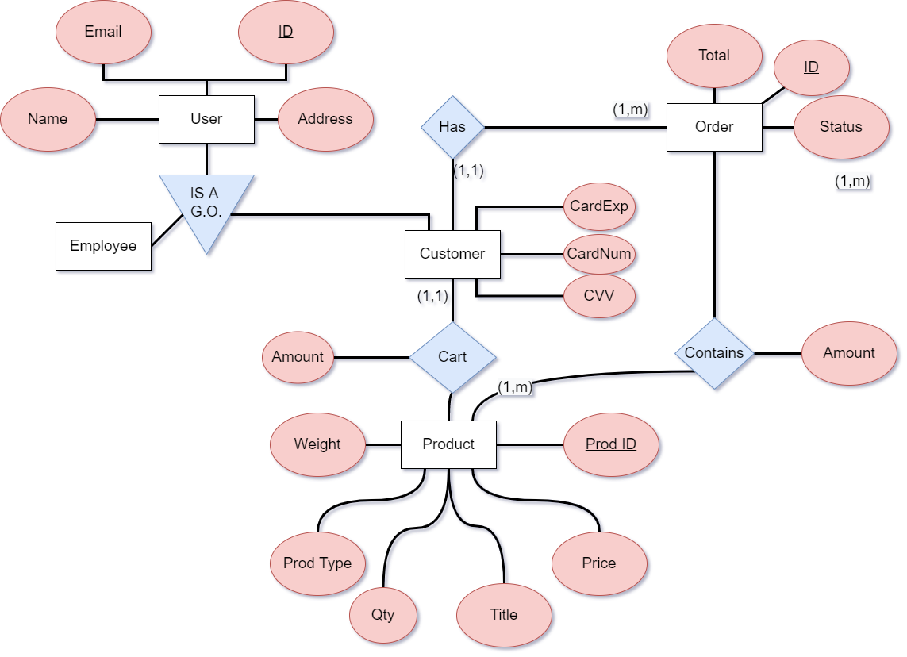

# groupproject - Web-based Store

We need the following for the project:
1. An ER Diagram for the store model with an explanation.
2. A schema based on the ER diagram.
3. A viable product using SQL and PHP/PDO (w/ HTML) deployed on one or more of our accounts.

Here's the requirements for the product itself we're developing (copied almost verbatim from the pdf):

Needs a user-facing side and an employee facing side.

Inventory:

	Has a view showing (at a minimun) a list of all products and how many of each are in stock. Especially for the owner of the store.

	Has a view showing products that are in stock.

	Has a view that provides details on an individual product.

	For the aformentioned 2-3 requirements, switching between views should be easy.
	
	Each product details page should be able to add a number of said product to the user's shopping cart.

Shopping Cart:

	Starts off as empty, growing as the user adds more to it.

	Should allow for multiple of one product to be in the cart.

	User should be able to remove item from or change number of an item in the shopping cart.

(Will need to store some kind of state information whether it be in the database, hidden form elements, or session variables.)

	Once the order is submitted, the items should be associated with the order so that it can be looked up later.

	Additionally, once the order is submitted, the shopping cart should cleared out or reset to empty.

	Shopping cart page should have a link or button to another page where they can check out.

Checking out:

	Should allow user to enter payment info including shipping address. (See note in pdf)

	Should allow user to see subtotal (add tax?) and finish submitting an order.

Orders:

	Order Tracking for the user:

		User should be able to visit URL to see a info on a past order and track its status.

		Status of order includes but is not limited to, "being proccessed," "Shipped," etc.

		Should be able to see what was paid for the order and how much has been paid overall.

	A list of all oustanding orders to give employees an idea of which orders still need to ship.

	An order fulfillment page, allowing employees to see details of an order, mark them as shipped, add notes, contact the user, etc.

See PDF for allowed tools.

Additional challenges:

	Make a web interfaces for employees/owner to add/remove/modify items.

	Add a functionality allowing customers to customize products when ordering (things like color).

	Add a functionality allowing for employees to add promo codes for discounts (affecting the final price).

	Add a functionality allowing for employees to add a sale for a specified time period (ex: 20% off specific items Black Friday only).

	Design a system of loyalty reward points that can be redeemed later.

	Design a wishlist system where users can add items they'd like to order at a later date.

Check the PDF if you're unsure about something here.

## Database Schema

### ER Diagram

### ER Diagram Description
[ER Diagram Description.docx](docs/ER Diagram Description.docx)

### 3NF

**USER** (<ins>ID</ins>, Email, Name, Address)

**PRODUCT** (<ins>ProdID</ins>, ProdType, Title, Weight, Price, QTY)

**EMPLOYEE** (<ins>EmpID&dagger;</ins>)

* FOREIGN KEY(EmpID) REFERENCES USER(ID)

**CUSTOMER** (<ins>CustID&dagger;</ins>, CardNum, CardExp, CVV)

* FOREIGN KEY(CustID) REFERENCES USER(ID)

**CART** (<ins>CustID&dagger;, ProdID&dagger;</ins>, Amt)

* FOREIGN KEY(CustID) REFERENCES CUSTOMER(CustID)
* FOREIGN KEY(ProdID) REFERENCES PRODUCT(ProdID)

**ORDERS** (<ins>OrderID&dagger;, CustID&dagger;</ins>, Status, Total)

* FOREIGN KEY(CustID) REFERENCES CUSTOMER(CustID)

**ORDERITEMS** (<ins>OrderID&dagger;, ProdID&dagger;</ins>, Amt)

* FOREIGN KEY(OrderID) REFERENCES ORDERS(OrderID)
* FOREIGN KEY(ProdID) REFERENCES PRODUCT(ProdID)
